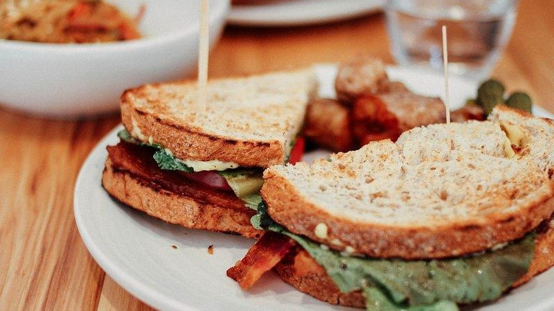

# git blt

# branches

<pre>
michael@random ~/Projects/yoyodyne (development =)
$ git branch

* development
  testing
  production
</pre>

&#160;

<pre>
michael@random ~/Projects/yoyodyne (development =)
$ git branches

* development Prepare Deployment 2023.05 (#95) (2 days ago) [Michael Ostermeier]
  testing Merge pull request #96 from origin/development (2 days ago) [Thomas Müller]
  production Merge pull request #97 from origin/testing (8 hours ago) [Thomas Müller]
</pre>

&#160;

# logs

<pre>
michael@random ~/Projects/yoyodyne (development =)
$ git log

commit bbb68f6cf4713272a1acd3a24fc3c72c6c67ad57
Author: Michael Ostermeier &lt;michael@example.com&gt;
Date: Tue May 30 10:20:40 2023 +0200
Prepare Deployment 2023.05 (#95)
* Added release notes for the 2023.05 deployment.

commit 119274b431313620c9d9308ede178279fd5aa828
Merge: c815163f 64ade212
Author: Thomas Müller &lt;thomas@example.com&gt;
Date: Tue May 30 10:05:10 2023 +0200
Merge pull request #94 from origin/issue-548

commit 64ade21231313620c9d9308ede178279c815163f
Author: Thomas Müller &lt;thomas@example.com&gt;
Date: Tue May 30 09:45:20 2023 +0200
Add nowrap CSS for Platform.
* Added nowrap CSS for Platform buttons and labels.

commit fc3c72c6c67ad57bbb68f6cf4713272a1acd3a24
Merge: f3e292bb a66a36b6
Author: Michael Ostermeier &lt;michael@example.com&gt;
Date: Tue May 22 16:25:35 2023 +0200
Merge pull request #93 from origin/issue-547
:
</pre>

&#160;

# logs

<pre>
michael@random ~/Projects/yoyodyne (development =)
$ git log --oneline –n 5

bbb68f6c (HEAD -> development, origin/development) Prepare Deployment 2023.05 (#95)
119274b4 Merge pull request #94 from origin/issue-548
64ade212 (origin/issue-548) Add nowrap CSS for Platform.
c815163f Merge pull request #93 from origin/issue-547
a66a36b6 (origin/issue-547) Added new News Channel.
</pre>

&#160;

<pre>
michael@random ~/Projects/yoyodyne (development =)
$ git logs -n 5

bbb68f6c (HEAD -> development, origin/development) Prepare Deployment 2023.05 (#95) (2 days ago) [
119274b4 Merge pull request #94 from origin/issue-548 (2 days ago) [Thomas Müller]
64ade212 (origin/issue-548) Add nowrap CSS for Platform. (2 days ago) [Thomas Müller]
c815163f Merge pull request #93 from origin/issue-547 (10 days ago) [Michael Ostermeier]
a66a36b6 (origin/issue-547) Added new News Channel. (10 days ago) [Michael Ostermeier]
</pre>

&#160;

# logs

<pre>
michael@random ~/Projects/yoyodyne (development =)
$ git logs readme.md

09d7cfb2 Removed proxy settings from the readme. (#76) (6 weeks ago) [Michael Ostermeier]
06ea4bc8 Added gitlab flow diagram to readme. (#29) (4 months ago) [Michael Ostermeier]
b681120e Changed scm link from Bitbucket to GitHub. (7 months ago) [Michael Ostermeier]
2cb53737 Removed unused list items from readme. (11 months ago) [Michael Ostermeier]
588df10d Added link to the deployment guide. (1 year, 3 months ago) [Michael Ostermeier]
8a763b51 Added link to the Maven POM reference. (1 year, 7 months ago) [Michael Ostermeier]
f2c293f0 Added readme.md with guides and links. (1 year, 7 months ago) [Michael Ostermeier]
</pre>

&#160;

<pre>
$ git logs --since="yesterday"                   // Daily Stand-Up Meeting
</pre>

<pre>
$ git logs --since="last friday"                 // Weekly Round Table
</pre>

<pre>
$ git logs --since="two weeks ago"               // Bi-Weekly Catch-Up
</pre>

&#160;

# tags

<pre>
michael@random ~/Projects/yoyodyne (development =)
$ git tag

deployment.2023.01
deployment.2023.02
deployment.2023.03
deployment.2023.04
</pre>

&#160;

<pre>
michael@random ~/Projects/yoyodyne (development =)
$ git tags

deployment.2023.01 Deployment Production, January 2023 (Thu Jan 26 15:08) [Michael Ostermeier]
deployment.2023.02 Deployment Production, February 2023 (Thu Mar 9 14:24) [Michael Ostermeier]
deployment.2023.03 Deployment Production, March 2023 (Tue Mar 28 13:37) [Thomas Müller]
deployment.2023.04 Deployment Production, April 2023 (Wed May 10 15:43) [Thomas Müller]
</pre>

&#160;

# intermission

# configuration

<pre>
michael@random ~/Projects/yoyodyne (development =)
$ git config --get-regexp alias

alias.co checkout
alias.move mv
alias.branches branch --format='%(HEAD) %(if)%(HEAD)%(then)%(color:brightyellow)%(else)%(color:yel
alias.logs log --format='%C(auto)%h%d %s %C(green)(%cr) %C(blue)[%aN]%C(reset)' -n 20
alias.tags tag --format='%(color:yellow)%(refname:short)%(color:reset) %(subject) %(color:green)(%
alias.tree log --graph --format='%C(auto)%h%d %s %C(green)(%cr) %C(blue)[%aN]%C(reset)'
</pre>

&#160;

<pre>
michael@random ~/Projects/yoyodyne (development =)
$ git config --edit --global
</pre>

&#160;

# configuration

<pre>
[alias]
    co = checkout
    move = mv
    branches = branch --format='%(HEAD) %(if)%(HEAD)%(then)%(color:brightyellow)%(else)%(color:yel
    logs = log --format='%C(auto)%h%d %s %C(green)(%cr) %C(blue)[%aN]%C(reset)' -n 20
    tags = tag --format='%(color:yellow)%(refname:short)%(color:reset) %(subject) %(color:green)(%
    tree = log --graph --format='%C(auto)%h%d %s %C(green)(%cr) %C(blue)[%aN]%C(reset)'
    configure = config --edit --global

[core]
    pager = less -F

[fetch]
    prune = true

[user]
    name = Michael Ostermeier
    email = michael@example.com
~
~
~
~
~
~
~
~
~/.gitconfig [unix] (14:05 05/06/2023)                                                     1,1 All
</pre>

&#160;

# contributors

<pre>
michael@random ~/Projects/yoyodyne (development =)
$ git shortlog --no-merges --numbered --summary

   1076 Michael Ostermeier
    269 Gabriel MOUTON
    254 Thomas Müller
    227 Gabriel Mouton
    154 Thomas Mueller
    140 demougab
    102 Nena Zimmermann
     88 DEMUETHO
     57 Hendrik Richter
     21 Stephan Lorenz
     20 Thorsten Ehlers
     10 Alexander Noll
</pre>

&#160;

# contributors

<pre>
michael@random ~/Projects/yoyodyne (development =)
$ git contributors

Michael Ostermeier       1065 ↑↑      51543 ++      30735 --       4711 🗋🗋
Gabriel Mouton            647 ↑↑      72146 ++      30177 --       2772 🗋🗋
Thomas Müller             482 ↑↑      22045 ++       9517 --       1177 🗋🗋
Nena Zimmermann           102 ↑↑      58622 ++      58750 --        274 🗋🗋
Hendrik Richter            57 ↑↑       3176 ++        185 --         56 🗋🗋
Stephan Lorenz             21 ↑↑       6275 ++       8609 --        104 🗋🗋
Thorsten Ehlers            20 ↑↑        702 ++         99 --         53 🗋🗋
Alexander Noll             10 ↑↑        689 ++        510 --         12 🗋🗋
</pre> 

&#160;

# contributors

<pre>
michael@random ~/Projects/yoyodyne (development =)
$ git contributors --since="last year"

Gabriel Mouton            128 ↑↑       4070 ++        782 --        311 🗋🗋
Michael Ostermeier         69 ↑↑        659 ++        243 --        159 🗋🗋
Thomas Müller              42 ↑↑       3099 ++       1849 --        173 🗋🗋
Stephan Lorenz             10 ↑↑       5035 ++       8105 --         49 🗋🗋
</pre>

&#160;

<pre>
michael@random ~/Projects/yoyodyne (development =)
$ cat .mailmap

Gabriel Mouton &lt;gabriel@example.com&gt;
Michael Ostermeier &lt;michael@example.com&gt;
Thomas Müller &lt;thomas@example.com&gt;
</pre>

&#160;

# links

* [Git - git-branch Documentation (git-scm.com)](https://git-scm.com/docs/git-branch)
* [Git - git-log Documentation (git-scm.com)](https://git-scm.com/docs/git-log)
* [Git - git-tag Documentation (git-scm.com)](https://git-scm.com/docs/git-tag)
* [Git - git-for-each-ref Documentation (git-scm.com)](https://git-scm.com/docs/git-for-each-ref)
* [Git - pretty-formats Documentation (git-scm.com)](https://git-scm.com/docs/pretty-formats)
* [Git - mailmap Documentation (git-scm.com)](https://git-scm.com/docs/gitmailmap)  

* [mosterme / git configuration (GitHub Gist)](https://gist.github.com/mosterme/36e539287442ba2f7f15121124032c13)
* [mosterme / git contributors (GitHub Gist)](https://gist.github.com/mosterme/f44bd5b69736a16fb5a3053fb2e19f0d)  

* [Write Better Commits, Build Better Projects (GitHub Blog)](https://github.blog/developer-skills/github/write-better-commits-build-better-projects/)

&#160;

# mahlzeit

