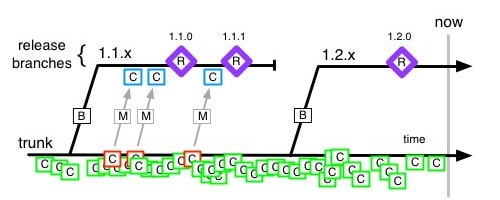
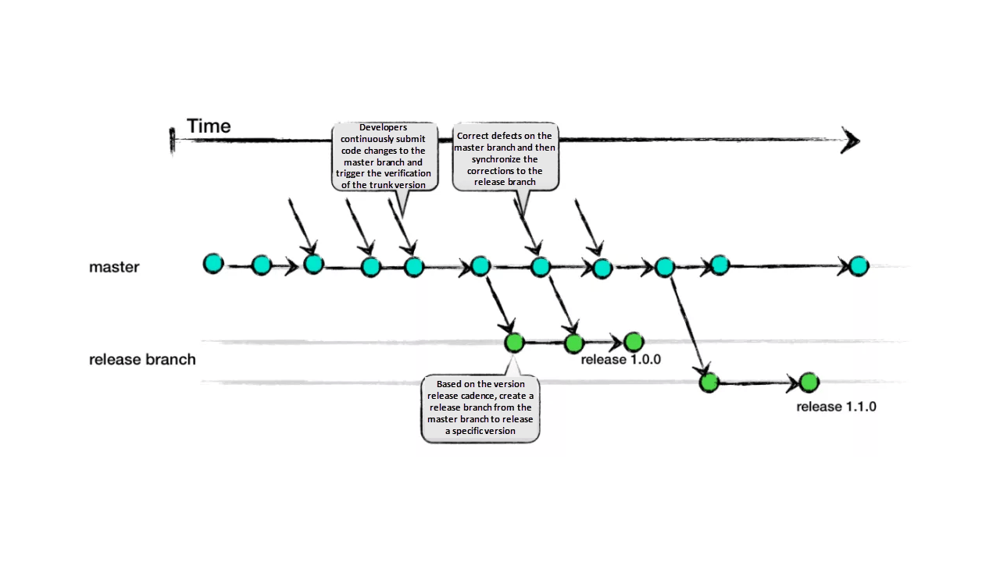
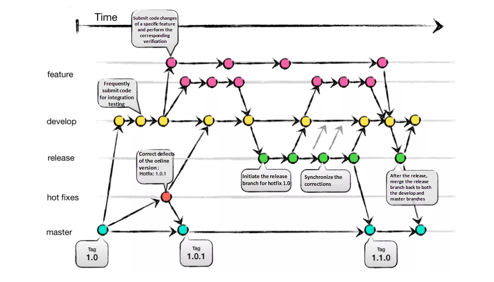
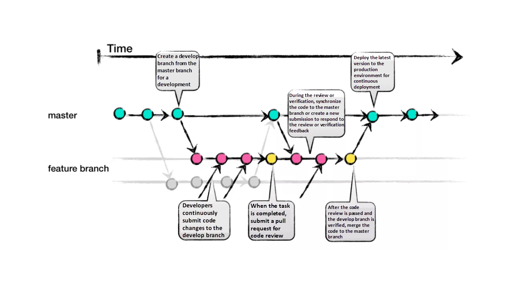
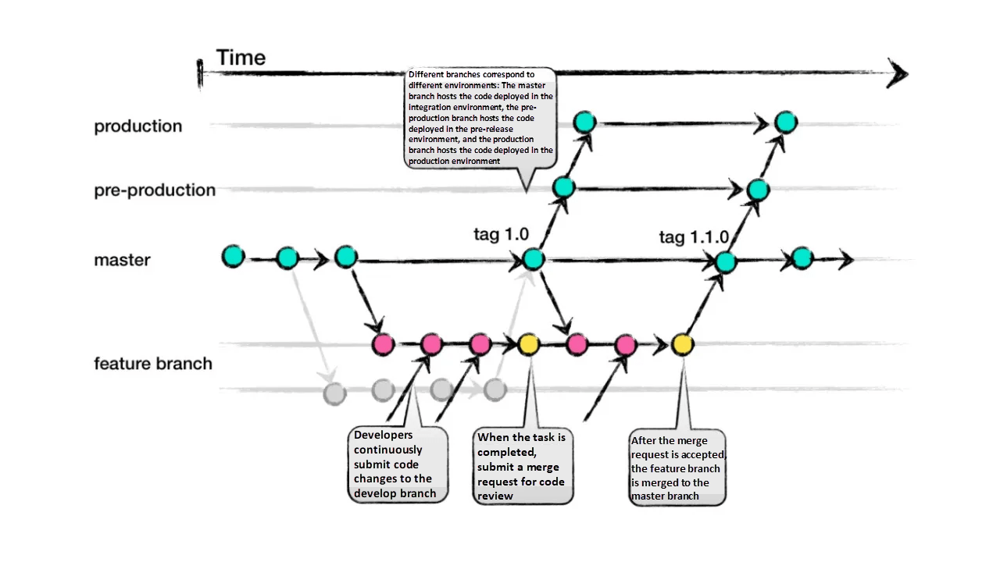
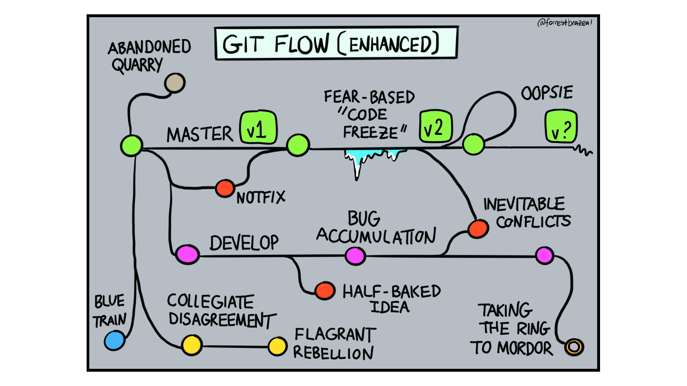
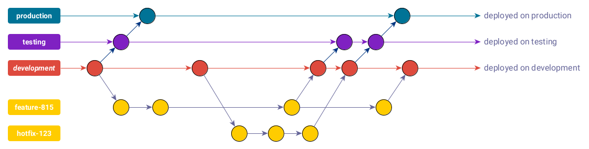

# git workflows (for subversion projects)

&#160;

# in the beginning (subversion / trunk based)

&#160;

* your project started as a subversion project
* with subversion you don‘t do branches ...
* even if you branch - you never merge!

&#160;

&#160;

# in the past (first git experience / feature branches)

&#160;

* now you have feature branches almost everywhere
* development is automatically deployed from master
* production is manually deployed from master
* releases are manually tagged on master

&#160;

&#160;

# time to review the process ...

&#160;

* for the development environment ci/cd works great
* for production deployments you still need manual steps

&#160;

* some features from development get approved slowly
* other features in development need to be deployed asap!

&#160;

* for production deployments you still need code-freezes
* i.e. you still hold back pull requests before deployments

&#160;

* improve ci/cd for all environments (development, testing, production)

&#160;

# evaluate different git workflows … Trunk Based Development

# evaluate different git workflows … Git Flow

# evaluate different git workflows … GitHub Flow

# evaluate different git workflows … GitLab Flow

# evaluate different git workflows … Git Flow (enhanced)

# choose a git workflow! problem?

&#160;

# [How to Select a Git Branch Mode?](https://www.alibabacloud.com/blog/how-to-select-a-git-branch-mode_597255)

&#160;

## Considering Product Type and Release Method, Team Size, Collaboration Maturity:

<table> 
<tr><th align="left">Product type and release method</th><th align="left">Team size</th><th align="left">Collaboration maturity</th><th align="left">Applicable branch mode</th></tr>
<tr><td>All (?) None (?)</td><td>Small</td><td>High</td><td>Trunk Based Development</td></tr>
<tr><td>Products that support continuous deployment and release, such as Web applications or SaaS products.</td><td>Middle</td><td>Moderate</td><td>GitHub-Flow and TBD</td></tr>
<tr><td>Products with a definite release window and a periodic version release cadence, such as iOS apps.</td><td>Middle</td><td>Moderate</td><td>Git-Flow and GitLab-Flow</td></tr>
<tr><td>Products that are demanding for product quality and support continuous deployment and release, such as basic platform products.</td><td>Middle</td><td>Moderate</td><td>GitLab-Flow</td></tr>
<tr><td>Products that are demanding for product quality and have a long maintenance cycle for released versions, such as 2B basic platform products.</td><td>Large</td><td>High</td><td>Git-Flow</td></tr>
</table>

&#160;

## Considering from the perspective of the number of required release versions:

* If a product needs to support multiple release versions, use Git-Flow.
* If a simple product needs to support a single release version, use GitHub-Flow or TBD.
* If a complex product needs to support a single release version, use GitLab-Flow.

&#160;

# [GitLab Flow – Best Practices](https://about.gitlab.com/topics/version-control/what-are-gitlab-flow-best-practices/)

&#160;

* Use feature branches, no direct commits on main.
* Test all commits, not only the ones on main.
* Run all the tests on all commits (have them run in parallel).
* Perform code reviews before merges into main, not afterwards.
* Deployments are automatic, based on branches or tags.
* Tags are set by the user, not by CI/CD.
* Releases are based on tags.
* Pushed commits are never rebased.
* Everyone starts from main, and targets main.
* Fix bugs in main first and release branches second.
* Commit messages reflect intent.

&#160;

[What is GitLab Flow? \| GitLab](https://about.gitlab.com/topics/version-control/what-is-gitlab-flow/)

&#160;

# GitLab Flow – branch layout

&#160;

&#160;

## Advantages
* Environment branches define the CI/CD pipeline
* The git history will be cleaner and more readable
* Ideal when there is a single version in production
&#160;

[Improving Continuous Delivery with GitLab Flow](https://techblog.exawizards.com/entry/2021/01/28/113812)

* All code changes flow in one direction (less conflicts)
* Building new instances for any environment is easy
* Comparing code from different stages becomes easy

&#160;

# Links

&#160;

* [A successful Git branching model \| Vincent Driessen](https://nvie.com/posts/a-successful-git-branching-model/)
* [Choosing the Right Git Branching Strategy \| Medium](https://medium.com/@sreekanth.thummala/choosing-the-right-git-branching-strategy-a-comparative-analysis-f5e635443423)
* [Comparing four branching workflows for Git \| Medium](https://medium.com/@patrickporto/4-branching-workflows-for-git-30d0aaee7bf)
* [How to Select a Git Branch Mode? \| Alibaba Cloud Blog](https://www.alibabacloud.com/blog/how-to-select-a-git-branch-mode_597255)
* [Improving Continuous Delivery with GitLab Flow \| exawizards](https://techblog.exawizards.com/entry/2021/01/28/113812)
* [Trunk-Based Development: A Love & Hate Story \| Medium](https://medium.com/comparethemarket/trunk-based-development-a-love-hate-story-be1587a13314)
* [What are GitLab Flow Best Practices? \| GitLab](https://about.gitlab.com/topics/version-control/what-are-gitlab-flow-best-practices/)
* [Write Better Commits, Build Better Projects \| GitHub Blog](https://github.blog/developer-skills/github/write-better-commits-build-better-projects/)

&#160;

# Thank you very much for your attention. Any questions?

&#160;

